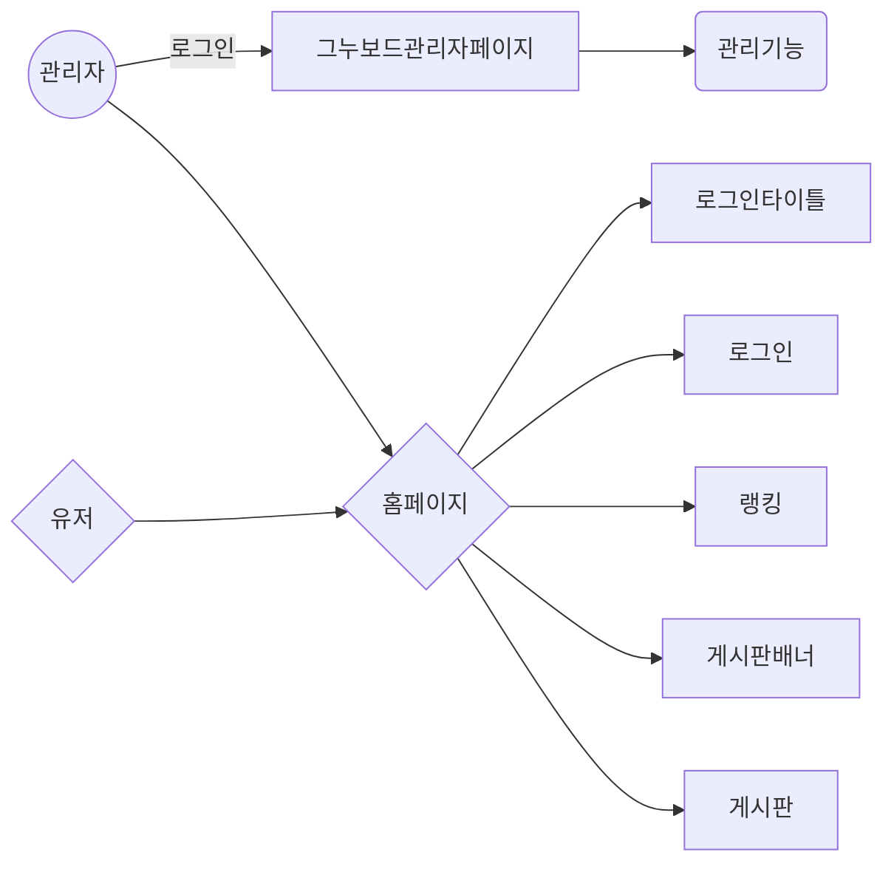

# skypark20191030
skypark20191030
# 스카이파크 TEST버전

## 관리자
	/admin/adm/으로 로그인하여 관리자페이지로 접속
	혹은 관리자로 접속하여도 문제는없다.

## 기능 flowchart
	


## 파일명 flowchart
```mermaid
graph LR
관리자((/admin/adm))  -- 관리자로그인 --> A[/admin/adm] 
/login.html -- 관리자로그인 --> C(관리기능)
/login.html -- 로그인 --> 홈페이지{/}
관리자((관리자)) --> 홈페이지{/}
유저{유저} --> 홈페이지{/}
홈페이지{홈페이지} -- 공용라이브러리 --> common.php
common.php -- 문자열라이브러리 --> asset.php
common.php -- DB라이브러리 --> dbcon.php
common.php -- 메인메뉴라이브러리 --> main_menu.php
common.php -- 로그인라이브러리 --> login_title.php
common.php -- 그누보드라이브러리 --> /admin/common.php
홈페이지{홈페이지} -- 로그인타이틀 --> login_title.php
홈페이지{홈페이지} -- 게시판배너 --> dbcon.php
홈페이지{홈페이지} -- 게시판내용 --> dbcon.php
홈페이지{홈페이지} -- 로그인기능 --> /admin/common.php
```
